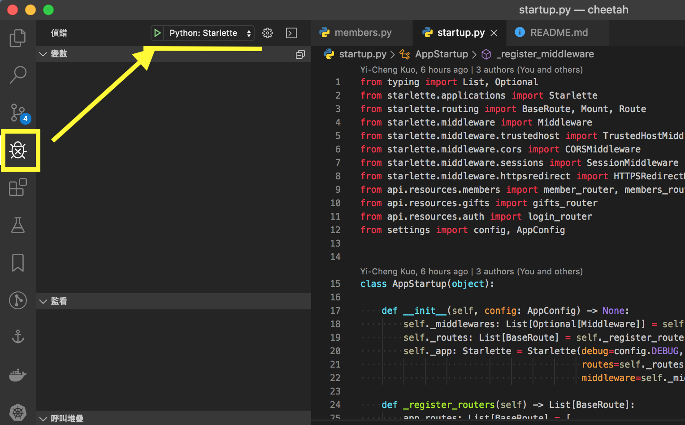
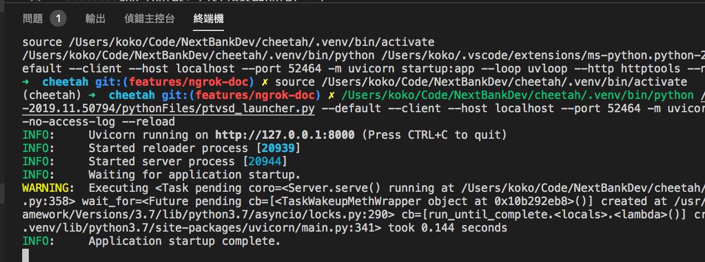
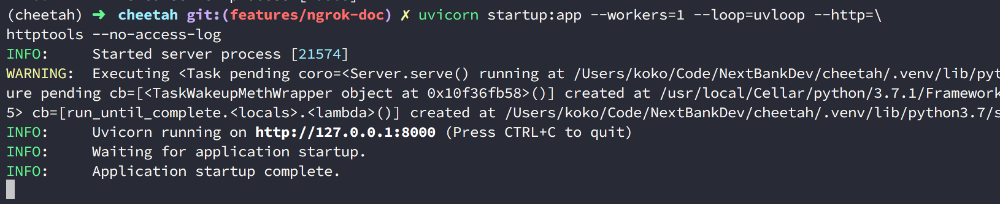

# cheetah
 
該專案為採用 `starlette` 這套非同步框架來實作 Domain-Driven Design 開發的 scaffold，此篇文檔將介紹如何啟動該專案。


## 專案環境
- 程式語言：`Python 3.7`
- 套件管理器：`Pipenv` ( 安裝的套件請參考 Pipefile )
- 使用 `ngrok` 來產生，並提供對外測試的 Host URL 用的工具

在啟動這個專案前，請確認你的電腦本機上具有 `Python 3.7` 的版本以及 Python 自帶的 `pip` 套件管理工具，以下將介紹 `Pipenv` 的安裝方式與 `ngrok` 的使用方式。


## 專案執行步驟 - 專案環境設定

### 1. 安裝 Pipenv
因該專案使用 `Pipenv` 套件來統一管理 Python 從外部 PyPI 下載的套件包，因此在開始前要先安裝 `Pipenv`。

而關於如何安裝 `Pipenv` 這部分，可以參考以下兩篇文章來學習建立：

1. [Python - 結合 pip 與 virtualenv 的虛擬環境與套件管理的二合一新利器 Pipenv](https://note.koko.guru/python-pipenv-install-and-usage.html#python-pipenv-install-and-usage)
2. [Python - 透過 .venv 管理 Pipenv 虛擬環境的來源](https://note.koko.guru/pipenv-use-dot-venv-folder.html#pipenv-use-dot-venv-folder)

其中 `.venv` 是為了把 `Pipenv` 為專案建立的虛擬環境，放置到專案底下，以協助可以直接維護所使用；若無使用 `.venv` ，則 `Pipenv` 會把下載的套件都安裝到預設的目錄下，且不同的系統 OS 皆會不同，因此建議使用 `.venv` 。

請記得，要進入該專案 `cheetah` 目錄下，並建立 `.venv` 以及使用 `Pipenv`。

以下為執行的指令：


```bash
Clone 下來後....

$> cd cheetah
$cheetah/> mkdir .venv # 建立 .venv
$cheetah/> pipenv install # 透過 pipenv 安裝套件
$cheetah/> pipenv shell # 進入 pipenv 為你建立的虛擬環境
$(cheetah)cheetah/> # 表示進入到虛擬環境了，如此也能讀到所有安裝的套件與指令
```

### 2. 啟動 Local Server
該專案採用 [Starlette](https://www.starlette.io/) 非同步框架，搭配使用 [uvloop](https://uvloop.readthedocs.io/) 與 [httptools](https://github.com/MagicStack/httptools) 作為底層的 ASGI 規範 [Uvicorn](https://www.uvicorn.org/) 作為 Server，來非同步處理請求。

因此在本機啟動 Uvicorn 的 Server 時，需要仰賴 `uvicorn` 的指令，以下有兩種方式可以執行：

註：確保目前是進入 `cheetah` 這個專案目錄下，並且有透過 `pipenv shell` 進入虛擬環境 (可以透過終端機或是 VSCode 的功能確認)，否則下面的方式都會因為讀不到套件而執行失敗。

#### 1. 採用 Debug Mode 執行
魷魚該專案是在 VScode 中撰寫，因此有在專案開發時，建立了 VSCode 用來提供 Debug 的設定檔 `launch.json`，就在 `.vscode` 目錄下，只要有該檔案，就可以執行使用而不需設定，請打開 VSCode，點選右邊的「昆蟲」圖示，以及顯示的綠色播放鍵，如下圖：




便會在下圖的「輸出」看到執行的訊息 (顯示 INFO 的 Log)，因為 `starlette` 預設是使用 `8000`，因此看到 INFO 時才會有 8000 這個 PORT：



此時，若你的 ngrok 也開啟了如前面圖示，便可以對外，並使用 `ncb.ngrok.io` 這個 HOST 網域來測試你撰寫 API 了。


#### 2. 在終端機下輸入指令執行
開啟終端機，並輸入以下指令：

```bash
$(cheetah)cheetah> uvicorn startup:app --workers=1 --loop=uvloop --http=httptools --no-access-log
```

便能看到如下圖的執行畫面：



